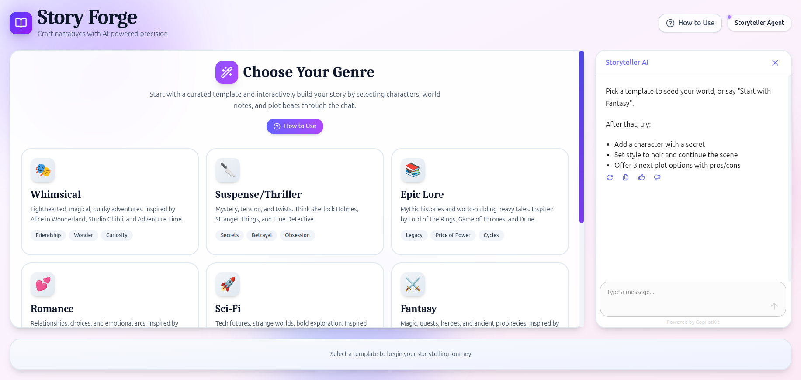
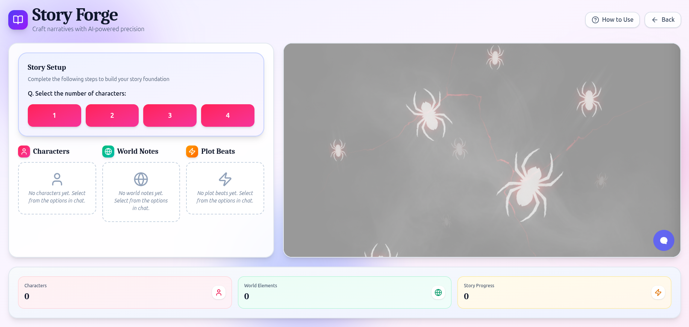
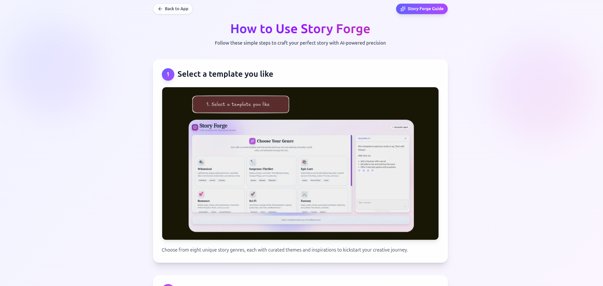

# Builders' Challenge #3: AI Agents 102
**Presented by Nosana and Mastra**


---

# 📖 Story Forge - AI Creative Writing Agent

**An intelligent AI agent that helps writers create compelling stories by generating characters, plot twists, and building immersive fictional worlds.**

## 🎯 Project Overview

Story Forge is an AI-powered creative writing assistant that leverages the Mastra framework to help authors, game designers, and storytellers overcome writer's block and develop rich narratives.

### Key Features

- **Character Generation** - Create detailed, multi-dimensional characters with backstories, motivations, and personality traits
- **Plot Twist Generator** - Generate unexpected story developments and narrative surprises
- **World Building** - Develop immersive fictional settings with geography, culture, and history
- **Interactive Frontend** - Beautiful, user-friendly interface for seamless interaction
- **Deployed on Nosana** - Running on decentralized compute infrastructure

## 🛠️ Tools & Technologies

### AI Tools Implemented

1. **generateCharacterTool** - Creates detailed character profiles including:
   - Name and physical description
   - Personality traits and quirks
   - Backstory and motivations
   - Character arcs and development

2. **plotTwistGeneratorTool** - Generates unexpected story elements:
   - Surprising revelations
   - Character betrayals
   - Hidden connections
   - Narrative reversals

3. **worldBuildingTool** - Develops fictional settings:
   - Geography and climate
   - Cultural systems and traditions
   - Historical events
   - Political structures

### Tech Stack

- **Framework**: [Mastra](https://mastra.ai) - AI agent orchestration
- **Frontend**: Next.js 14 with React
- **UI Library**: CopilotKit for AI chat interface
- **LLM**: Qwen3:8b via Ollama (hosted on Nosana)
- **Database**: Turso (libSQL) for agent memory and state
- **Deployment**: Docker container on Nosana decentralized network
- **No External APIs** - All processing done within the agent

## 🚀 Getting Started

### Prerequisites

- Node.js 18+ and pnpm
- Docker (for containerization)
- Git

### Installation

1. **Clone the repository**
```bash
git clone https://github.com/yogeshkhutwad34/agent-challenge
cd agent-challenge
```

2. **Install dependencies**
```bash
pnpm install
```

3. **Configure environment variables**

For local development, create a `.env` file with your Ollama API and Mastra DB credentials. For production deployment, use the pre-configured Docker image which includes all necessary environment variables.

4. **Run the development servers**
```bash
# Terminal 1 - Start the frontend
pnpm run dev:ui

# Terminal 2 - Start the Mastra agent server
pnpm run dev:agent
```

5. **Access the application**
- Frontend: http://localhost:3000
- Mastra Playground: http://localhost:4111

## 📦 Docker Deployment

### Build and Run Locally

```bash
# Build the Docker image
docker build -t yogeshk34/agent-challenge:latest .

# Run locally
docker run -p 3000:3000 yogeshk34/agent-challenge:latest

# Access at http://localhost:3000
```

### Published Docker Image

The production-ready container is available on Docker Hub:

```bash
docker pull yogeshk34/agent-challenge:latest
```

**Docker Hub**: [yogeshk34/agent-challenge](https://hub.docker.com/r/yogeshk34/agent-challenge)

**Note**: Environment variables are pre-configured in the Docker image via `COPY .env ./` in the Dockerfile. No additional configuration needed when pulling the image.

## ☁️ Nosana Deployment

The agent is running on Nosana's decentralized compute network with:
- GPU acceleration for LLM inference
- Containerized deployment
- High availability
- Decentralized infrastructure

### Deploy Your Own

1. **Using Nosana Dashboard**:
   - Visit [Nosana Dashboard](https://dashboard.nosana.com/deploy)
   - Use the job definition in `nos_job_def/nosana_mastra.json`
   - Update with your Docker image: `yogeshk34/agent-challenge:latest`
   - Select GPU and deploy

2. **Using Nosana CLI**:
```bash
npm install -g @nosana/cli
nosana job post --file ./nos_job_def/nosana_mastra_job_definition.json --market nvidia-3090 --timeout 30
```

## 💡 Usage Examples

### Generate a Character

**Prompt**: "Create a mysterious detective character for a noir story"

**Output**: The agent generates a detailed character profile with name, appearance, personality traits, backstory, and character arc.

### Create a Plot Twist

**Prompt**: "Generate a plot twist for a story about a space explorer"

**Output**: The agent creates an unexpected narrative development that adds depth and surprise to your story.

### Build a World

**Prompt**: "Design a fantasy world with magic and ancient civilizations"

**Output**: The agent develops a comprehensive fictional setting with geography, culture, history, and unique characteristics.

## 📸 Screenshots

### Frontend Interface

*Main chat interface for interacting with the Story Forge agent*


*Example of character generation in action*


*World building tool creating immersive settings*

## 🎥 Video Demonstration

**Watch the full demo**: https://drive.google.com/file/d/1iWrIR2pREyYmdntCpVKpcAJxwYM15ljp/view?usp=drive_link

The video showcases:
- Story Forge running on Nosana infrastructure
- All three tools in action (character, plot twist, world building)
- Real-time AI generation
- Frontend interface and user experience
- Practical creative writing use cases

## 📱 Social Media

**Twitter/X Post**: https://x.com/yogeshkhutwad34/status/1983499154434191723

Follow the project and share your stories created with Story Forge! #NosanaAgentChallenge

## 🏗️ Architecture

```
┌─────────────────┐
│   Next.js UI    │  ← User Interface (Port 3000)
└────────┬────────┘
         │
         ↓
┌────────────────��┐
│  Mastra Agent   │  ← Agent Orchestration (Port 4111)
│   - Character   │
│   - Plot Twist  │
│   - World Build │
└────────┬────────┘
         │
         ↓
┌─────────────────┐
│  Qwen3:8b LLM   │  ← AI Model (Nosana Hosted)
└────────┬────────┘
         │
         ↓
┌─────────────────┐
│  Turso DB       │  ← Agent Memory & State
└─────────────────┘
```

## 🔧 Environment Variables

Environment variables are pre-configured in the Docker image. For local development, you'll need:

| Variable | Description | Required |
|----------|-------------|----------|
| `OLLAMA_API_URL` | Ollama API endpoint URL | Yes |
| `MODEL_NAME_AT_ENDPOINT` | LLM model name (qwen3:8b) | Yes |
| `MASTRA_DB_URL` | Turso database connection URL | Yes |
| `MASTRA_DB_AUTH` | Turso authentication token | Yes |

**Note**: The Dockerfile uses `COPY .env ./` to include environment variables in the container build.

## 🎯 Real-World Applications

Story Forge comes with 5 prebuilt templates that you can use to quickly generate tailored creative output. The available templates are:

- Whimsical
- Horror
- Epic Lore
- Romantic
- Thriller

Story Forge can be used for many creative scenarios, including:

- **Novel Writing** - Generate characters and plot developments for fiction
- **Game Design** - Create NPCs, quests, and game worlds
- **Screenwriting** - Develop characters and story arcs for scripts
- **Tabletop RPGs** - Build campaigns, characters, and settings
- **Creative Writing Education** - Teaching tool for story structure
- **Content Creation** - Generate ideas for blogs, videos, and social media

## 🏆 Challenge Submission Checklist

- [x] **Agent with Tool Calling** - 3 custom tools implemented
- [x] **Frontend Interface** - Next.js UI with CopilotKit
- [x] **Deployed on Nosana** - Running on decentralized network
- [x] **Docker Container** - Published to Docker Hub
- [x] **Video Demo** - 1-3 minute demonstration
- [x] **Updated README** - Complete documentation
- [x] **Social Media Post** - Shared with #NosanaAgentChallenge

## 📚 Learning Resources

- [Nosana Documentation](https://docs.nosana.io)
- [Mastra Documentation](https://mastra.ai/en/docs)
- [CopilotKit Documentation](https://docs.copilotkit.ai)
- [Next.js Documentation](https://nextjs.org/docs)
- [Docker Documentation](https://docs.docker.com)

## 🤝 Contributing

Contributions are welcome! Feel free to:
- Report bugs
- Suggest new creative writing tools
- Improve documentation
- Add new features

## 📄 License

This project is part of the Nosana Builders Challenge #3.

## 🙏 Acknowledgments

- **Nosana** - For providing decentralized compute infrastructure
- **Mastra** - For the excellent AI agent framework
- **CopilotKit** - For the beautiful chat interface
- **Turso** - For the database infrastructure

---

**Built with ❤️ for the Nosana Builders Challenge**

*Empowering writers with AI-powered creativity on decentralized infrastructure*